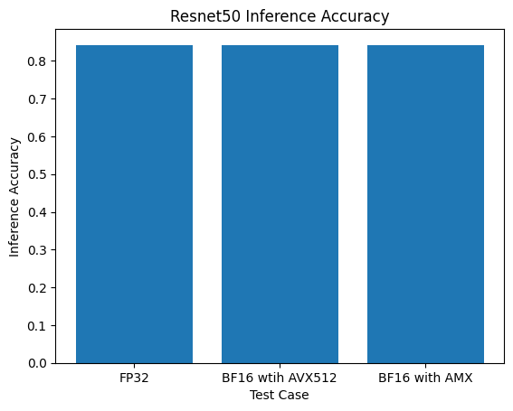

# Enabling Auto-Mixed Precision for Transfer Learning with TensorFlow
This tutorial guides you through the process of enabling auto-mixed precision to use low-precision datatypes, like bfloat16, for model inference with TensorFlow* (TF).

The Intel® Optimization for TensorFlow* enables TensorFlow* with optimizations for performance boost on Intel® hardware. For example, newer optimizations include AVX-512 Vector Neural Network Instructions (AVX512 VNNI) and Intel® Advanced Matrix Extensions (Intel® AMX).

| Area                    | Description
|:---                     |:---
| What you will learn     | Inference performance improvements with Intel® AMX BF16
| Time to complete        | 10 minutes
| Category                | Code Optimization


## Purpose

The Intel® Optimization for TensorFlow* gives users the ability to speed up inference on Intel® Xeon Scalable processors with lower precision data formats and specialized computer instructions. The bfloat16 (BF16) data format uses half the bit width of floating-point-32 (FP32), lowering the amount of memory needed and execution time to process. You should notice performance optimization with the AMX instruction set when compared to AVX-512.

## Prerequisites

| Optimized for                     | Description
|:---                               |:---
| OS                                | Ubuntu* 18.04 or newer
| Hardware                          | Intel® Xeon® Scalable processor family or newer
| Software                          | Intel® AI Analytics Toolkit (AI Kit)

### For Local Development Environments

You will need to download and install the following toolkits, tools, and components to use the sample.

- **Create a virtual environment venv-tf using Python 3.8**

```
pip install virtualenv
# use `whereis python` to find the `python3.8` path in the system and specify it. Please install `Python3.8` if not installed on your system.
virtualenv -p /usr/bin/python3.8 venv-tf
source venv-tf/bin/activate

# If git, numactl and wget were not installed, please install them using
yum update -y && yum install -y git numactl wget
```

- **Install [Intel optimized TensorFlow](https://pypi.org/project/intel-tensorflow/2.11.dev202242/)**
```
# Install Intel Optimized TensorFlow
pip install intel-tensorflow==2.11.dev202242
pip install keras-nightly==2.11.0.dev2022092907
```

- **Jupyter Notebook**

  Install using PIP: `$pip install notebook`. <br> Alternatively, see [*Installing Jupyter*](https://jupyter.org/install) for detailed installation instructions.

- **Other dependencies**

  You will need to install the additional packages in requirements.txt and **Py-cpuinfo**.
  ```
  pip install -r requirements.txt
  python -m pip install py-cpuinfo
  ```

### For Intel® DevCloud

The necessary tools and components are already installed in the environment. You do not need to install additional components. See [Intel® DevCloud for oneAPI](https://devcloud.intel.com/oneapi/get_started/) for information.

## Key Implementation Details

This code sample uses a pre-trained on ResNet50v1.5 pretrained model, trained on the ImageNet dataset and fine-tuned on TensorFlow Flower dataset. The FP32 model is validated using FP32 and BF16 precision, including the use of Intel® Advanced Matrix Extensions (AMX) on BF16. AMX is supported on BF16 and INT8 data types starting with 4th Gen Xeon Scalable Processors. The inference time will be compared, showcasing the speedup of BF16 and AMX.
The sample tutorial contains one Jupyter Notebook and one Python script. You can use either.

### Jupyter Notebook

| Notebook                                                         | Description
|:---                                                              |:---
|`IntelTensorFlow_AMX_BF16_Inference.ipynb` | TensorFlow Inference Optimizations with Advanced Matrix Extensions Bfloat16

### Python Scripts

| Script                                                        | Description
|:---                                                              |:---
|`IntelTensorFlow_AMX_BF16_Inference.py` | The script performs inference with AMX BF16 and compares the performance against the baseline


## Run the Sample on Linux*
1. Launch Jupyter Notebook.
   ```
   jupyter notebook --ip=0.0.0.0
   ```
2. Follow the instructions to open the URL with the token in your browser.
3. Locate and select the Notebook.
   ```
   enabling_automixed_precision_transfer_learning_tensorflow.ipynb
   ````
4. Change your Jupyter Notebook kernel to **tensorflow** or **intel-tensorflow**.
5. Run every cell in the Notebook in sequence.


### Run the Sample on Intel® DevCloud

1. If you do not already have an account, request an Intel® DevCloud account at [*Create an Intel® DevCloud Account*](https://intelsoftwaresites.secure.force.com/DevCloud/oneapi).
2. On a Linux* system, open a terminal.
3. SSH into Intel® DevCloud.
   ```
   ssh DevCloud
   ```
   > **Note**: You can find information about configuring your Linux system and connecting to Intel DevCloud at Intel® DevCloud for oneAPI [Get Started](https://devcloud.intel.com/oneapi/get_started).
4. Follow the instructions to open the URL with the token in your browser.
5. Locate and select the Notebook.
   ```
   enabling_automixed_precision_transfer_learning_tensorflow.ipynb
   ````
6. Change the kernel to **tensorflow** or **intel-tensorflow**.
7. Run every cell in the Notebook in sequence.


#### Troubleshooting

If you receive an error message, troubleshoot the problem using the **Diagnostics Utility for Intel® oneAPI Toolkits**. The diagnostic utility provides configuration and system checks to help find missing dependencies, permissions errors, and other issues. See the [Diagnostics Utility for Intel® oneAPI Toolkits User Guide](https://www.intel.com/content/www/us/en/develop/documentation/diagnostic-utility-user-guide/top.html) for more information on using the utility.


## Example Output
If successful, the sample displays [CODE_SAMPLE_COMPLETED_SUCCESSFULLY]. Additionally, the sample generates performance and analysis diagrams for comparison.

The following image shows approximate performance speed increases using AMX BF16 with auto-mixed precision during inference. To see more performance improvement between AVX-512 BF16 and AMX BF16, increase the number of required computations in one batch.


With the imporovement on model inference speed, using AMX BF16 with auto-mixed precision during inference will not influence the inference accuracy.




## License

Code samples are licensed under the MIT license. See
[License.txt](https://github.com/oneapi-src/oneAPI-samples/blob/master/License.txt) for details.

Third party program Licenses can be found here: [third-party-programs.txt](https://github.com/oneapi-src/oneAPI-samples/blob/master/third-party-programs.txt).
